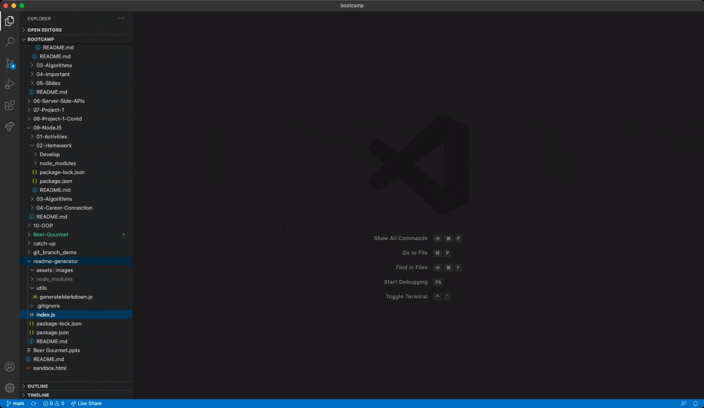

# README Generator

## Description

Creating a README file by using a command-line that dynamically generates a professional README.md file from a user's input using the [Inquirer package](https://www.npmjs.com/package/inquirer). This allows the project creator to devote more time to working on the project.

The application will be invoked by using the following command:

```bash
node index.js
```

A walkthrough video has been provided to demonstrate its functionality.

## User Story

As a developer, I want a README generator so that I can quickly create a professional README for each new project.

## Demo
See below: 



https://tracy80s2003.github.io/readme-generator/